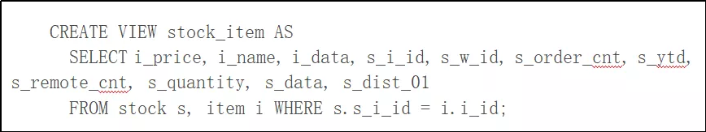
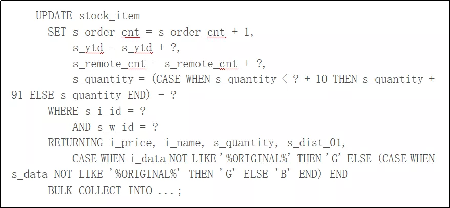

# 3-基准测试之SQL优化

作者：陈萌萌、潘毅 2019 年 10 月 21 日

TPC-C 是一个非常严苛的基准测试模型，考验的是一个完备的关系数据库系统全链路的能力。这也是为什么在 TPC-C 的榜单前列，出现的永远只是大家熟知的那几家在业界有着几十年积累、从关系数据库理论开始发展就差不多同步出现的数据库公司。接下来我们通过这篇文章为您分析在 TPC-C 测试中 OceanBase 数据库的 SQL 模块具体遇到了哪些挑战、做出了哪些优化。

对 TPC-C 有所了解人都知道，TPC-C 是一个典型的 OLTP (On-Line Transaction Processing) 场景测试，考察的是数据库在高并发压力场景下的事务处理能力，最终的性能指标以 tpmC(transaction per minute，也即每分钟系统处理 TPC-C 模型中的 new order 事务的数量)和平均到每 tpmC 的系统成本作为衡量标准。在 OLTP 场景中，每条请求的响应时间都是极短的。因此，各个数据库厂商在进行 TPC-C 测试时，都会尽一切可能将每一个操作时间压缩到最短，不夸张的说，在 TPC-C 的测试中，一些关键操作的优化往往需要细化到 CPU 指令级。

在进入我们的主题前，我们先来谈谈 TPC-C 中的事务模型，主要分为五种事务，订单创建、订单支付、订单查询、订单发货以及库存查询，这五种事务按照一定的比例发生，测试最终衡量的是每分钟订单创建事务的执行个数。大家知道，每一个数据库的事务，其实就是由一定逻辑关系关联的若干条 SQL 语句组成，他们在一个事务中，要么全部成功，要么全部失败，这个在数据库中称为“原子性”，也就是 ACID 中的“A”。那么 TPC-C 中的一个事务的耗时大约是多久呢？看一下报告就很清楚了——只有十几个毫秒。考虑到一个事务由多条 SQL 构成，那么每一条 SQL 的平均耗时都不到 1 毫秒！

在 C/S（client-server）模型中，一条 SQL 语句从发起到执行完成需要经历从客户端输入、网络传输、SQL 优化、执行、结果返回到客户端这样一个流程。而具体每一条 SQL 的执行可能只是做一个字段的更新，所需要的执行时间是非常短暂的，从整个链路的角度来看，大量的时间会花费在与客户端的交互过程中，造成资源的浪费和耗时的增加。那么如何解决这个问题的呢？答案就是使用存储过程。

## 存储过程 ##
所谓“存储过程”就是数据库为用户提供的一种面向过程的编程语言。基于这种语言，用户可以将应用程序的逻辑封装为一个可调用的过程（procedure）存放在数据库中并随时进行调用。通过这种方式，用户可以将本来需要与数据库进行多次交互才能完成的工作通过一次交互完成，省去了中间网络的传输和等待时间（参见图 1）。假如一条事务的网络开销平均是 30%，也就是说 30% 的 CPU 都花在了网络的收发和解析上。那么在 6 千万规模 tpmC 测试中节省下来 30% 的 CPU 资源换算成系统处理能力是惊人的。使用存储过程还可以带来事务响应时间的下降，导致数据库内核中事务锁的临界区缩短，间接的提升了系统 CPU 利用率，整个吞吐量也随之提高。存储过程在缩短应用端的等待耗时上同样有很大作用。

​
图 1 传统的 C/S 模型与使用存储过程的执行方式对比

在 TPC-C 中，存储过程对于整个系统的执行效率提升是至关重要的。OceanBase 2.2 版本不仅全面支持了存储过程，而且对存储过程的执行效率做了大量极致的优化。

## 编译执行 ##
存储过程作为一种面向过程的高级语言，需要转换成机器码才能够执行。这个过程一般可以分为“编译执行”和“解释执行”两种，一般来说，编译执行相比解释执行有代码优化充分、执行效率高等特点。OceanBase 利用近两年逐渐成熟的 LLVM 编译器框架实现了一个支持存储过程的编译器，通过动态编译（Just-in-Time Compilation）的方式将存储过程翻译成高效的二进制可执行代码，在执行效率上获得了数量级的提升。同时，过程中 LLVM 框架将存储过程转换为与机器无关的中间代码，使得存储过程也自然而然地获得了跨平台的编译执行能力，LLVM 内置的优化过程确保我们在各种不同的硬件平台上都可以获得正确、高效的可执行代码。
## Array Binding ##
另外一个在 TPC-C 测试中发挥了重要作用的功能就是对 DML 语句进行批量处理的能力，在 Oracle 中该功能也称为“Array Binding”。一条 SQL 在数据库中的执行过程大致上可以分为“计划生成”和“执行”两个阶段。尽管我们对 SQL 的执行计划做了高速缓存，但找到一个合适的执行计划在整个执行过程中仍然是比较耗时的一个部分。那有没有办法省去这个时间呢？当一组 SQL 的执行计划完全一样而只有执行参数不同时，在存储过程中我们可以通过特定的语法将他们的执行做成一个批量处理的过程，此时“计划生成”只需要做一次即可，这就是所谓的“Array Binding”。

在 Array Binding 中，数据库会首先找到需要使用的计划，然后执行该计划，并在每次执行完毕后，重新执行参数绑定（binding）的过程。打个比方，这就像是在一个 C 语言的 for 循环中，反复赋值而不是重新定义一个数据结构。Array Binding 的使用受用户控制，需要在存储过程中使用 FORALL 关键字来触发这一功能，在 TPC-C 的测试过程中，我们多次使用了 Array Binding 来提升系统的处理能力，效果非常明显。

## Prepared Statement 与执行计划缓存 ##
Prepared Statement 是一种二进制的请求交互协议，可以大大降低系统的交互成本。OceanBase 不仅支持用户程序与数据库间使用 Prepared Statement, 也支持在存储过程引擎调用 SQL 引擎执行时使用这种交互方式。存储过程在对 SQL 进行一次 Prepare 操作并获取唯一 id 后, 后续的每次执行仅需要传入该 id 和对应的参数,系统可以通过高速缓存找到对应的存储过程或 SQL 计划开始执行。该过程相比使用 SQL 文本的交互方式，省去了大量请求文本解析的 CPU 开销。

OceanBase 内部实现了高速缓存来缓存存储过程的可执行代码及 SQL 执行计划, 不同参数的存储过程和 SQL 可以通过这一高速缓存快速获取需要的执行对象, 耗时一般在几十微秒以内, 有效避免了重新编译带来的毫秒级的延迟和 CPU 消耗。

## 可更新视图 ##
在 OLTP 场景中，通过减少应用与数据库的交互次数来实现性能提升的例子很多，可更新视图就是其中之一。我们常见的数据库视图通常是只读的，通过定义视图，用户可以定义自己感兴趣的数据以及其获取接口，但视图同时也可以作为更新操作的入口，比如在 TPC-C 的 new order 创建场景中，应用需要得到商品信息，更新库存并得到更新后的值。一般可以通过两条 SQL 实现这一过程：

​
但通过建立一个可更新视图：

我们就可以通过一条语句更新库存并得到商品和库存信息：

这样就省去了一条语句的交互，并且更新逻辑更加直观。可更新视图允许用户可以像普通表一样操作视图，但不是所有视图都可以定义为可更新视图。比如带 distinct, group by 的视图，具体更新哪些行语义是不明确的，因此不能允许更新。具体到上面的 stock_item 两表 join 的视图，需要满足所更新表的 unique key 在 join 之后保持 unique (key-preserved table)，即 item.i_id 必须是唯一的这个前提。

需要强调，TPC-C 规范禁止使用物化视图，而可更新视图并没有改变底层数据表格的存储形式，是符合规范的。

## 总结 ##
因为 TPC-C 的设计原则是尽可能的“真实”反应一个 OLTP 系统的运行场景，我们所做的很多优化都具有广泛的适用性。例如，对于一个高并发的 OLTP 系统来说，大部分的 SQL 请求的耗时是非常短的，采用纯粹的 C/S 交互模型的后果必然使系统的时间浪费在应用与数据库的频繁交互中，而使用存储过程可以大大缓解这种交互的耗时，并且增强系统对于网络抖动的免疫力，这种核心能力对于一个分布式 OLTP 数据库是不可或缺的。

OceanBase 从创立伊始就坚持走自主研发的道路，这个选择确保了我们对数据库内核有着完全的掌控能力，让我们有在任何场景下追求极致性能的底气和实力的同时，也对产品形态的发展方向有更清晰的规划和目标。在这次的 TPC-C 测试中，我们采用了 OceanBase 2.0 版本开始支持的 Oracle 兼容模式，存储过程和 SQL 全部使用了兼容 Oracle 的数据类型和语法，这样做也是为了在追求极致优化的同时，确保产品迭代可以沿着通用和正规的方向发展。从 OceanBase 2.0 版本开始，OceanBase 就不断朝着 Oracle 兼容这个大的目标前进，随着 2.2 版本支持的存储过程（PL/SQL）功能的完善，我们的产品功能也完成了一轮新的迭代。我们坚信这次的 TPC-C 测试结果不仅仅见证了 OceanBase 的极致性能，也将成为 OceanBase 数据库走向成熟产品的一个新起点。

作者介绍：

陈萌萌，现任蚂蚁金服 OceanBase 团队资深技术专家，负责 OceanBase SQL 方向的研发工作。2006 年毕业于清华大学，2006 年到 2008 年在欧洲核子研究中心（CERN）负责网格计算调度器的开发工作，2009 年在美国威斯康星大学麦迪逊分校获得计算机硕士学位，先后在 Oracle、华为美国研究所从事数据库的开发和研究。

潘毅，现任蚂蚁金服 OceanBase 团队资深技术专家，负责 OceanBase 的并行查询和新一代 OLAP 引擎。曾就职于美国 Oracle 公司，负责 Oracle 数据库并行查询研发工作并有多项专利申请。

本文转载自公众号蚂蚁金服科技（ID：Ant-Techfin）。

原文链接：
​https://mp.weixin.qq.com/s/zLEVB96DtAJi8vqKZfLVFA